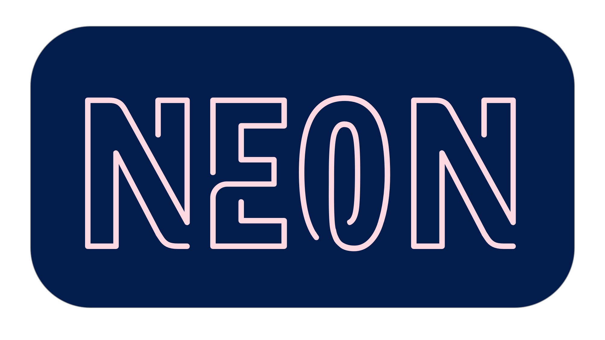

[](https://github.com/neon-bindings/neon/actions?query=workflow%3A%22Test+on+Linux%22)
[](https://github.com/neon-bindings/neon/actions?query=workflow%3A%22Test+on+MacOS%22)
[](https://github.com/neon-bindings/neon/actions?query=workflow%3A%22Test+on+Windows%22)
[](https://crates.io/crates/neon)
[](https://www.npmjs.com/package/neon-cli)

Rust bindings for writing safe and fast native Node.js modules.

# Getting started

Once you have the [platform dependencies](https://neon-bindings.com/docs/getting-started#install-node-build-tools/) installed, getting started is as simple as:

```
$ npm install -g neon-cli
$ neon new my-project
```

Then see the [Hello World guide](https://neon-bindings.com/docs/hello-world/) for writing your first Hello World in Neon!

# Docs

See our [Neon fundamentals docs](https://neon-bindings.com/docs/primitives) and our [API docs](https://neon-bindings.com/api/neon/).

# Platform Support

### Operating Systems

| Linux  | macOS | Windows |
| ------ | ----- | ------- |
| ✓      | ✓     | ✓       |

### Node.js

| Node 10 | Node 12 | Node 14 |
| ------- | ------- | ------- |
| ✓       | ✓       | ✓       |

Support for [LTS versions of Node](https://github.com/nodejs/LTS#lts-schedule) and current are expected. If you're using a different version of Node and believe it should be supported, let us know.

### Rust

Neon supports Rust stable version 1.18 and higher. We test on the latest stable, beta, and nightly versions of Rust.

# A Taste...

```rust
fn make_an_array(mut cx: FunctionContext) -> JsResult<JsArray> {
    // Create some values:
    let n = cx.number(9000);
    let s = cx.string("hello");
    let b = cx.boolean(true);

    // Create a new array:
    let array: Handle<JsArray> = cx.empty_array();

    // Push the values into the array:
    array.set(&mut cx, 0, n)?;
    array.set(&mut cx, 1, s)?;
    array.set(&mut cx, 2, b)?;

    // Return the array:
    Ok(array)
}

register_module!(mut cx, {
    cx.export_function("makeAnArray", make_an_array)
})
```

For more examples, see our [examples repo](https://github.com/neon-bindings/examples).

# Get Involved

The Neon community is just getting started and there's tons of fun to be had. Come play! :)

The [Rust Bindings community Slack](https://rust-bindings.slack.com) is open to all; use [the Slackin app](https://rust-bindings-slackin.herokuapp.com) to receive an invitation.

# License

Licensed under either of

 * Apache License, Version 2.0 ([LICENSE-APACHE](LICENSE-APACHE) or http://www.apache.org/licenses/LICENSE-2.0)
 * MIT license ([LICENSE-MIT](LICENSE-MIT) or http://opensource.org/licenses/MIT)

at your option.
