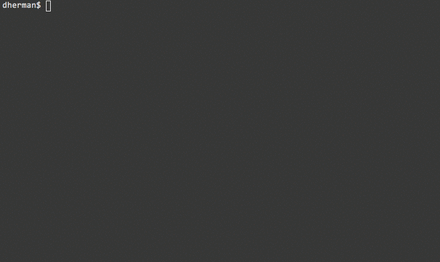

# The Neon Command-Line Tool

[](https://travis-ci.org/neon-bindings/neon-cli)
[](https://www.npmjs.com/package/neon-cli)

Automatically create and build [Neon](https://github.com/neon-bindings/neon) modules.



# Getting started

Install `neon-cli` as a global package:

```
npm install -g neon-cli
```

To create a new Neon project, use `neon new`:

```
neon new my-project
```

This will ask you a few questions and then generate a project skeleton for you. Follow the instructions from there to build and run your project!

# Requirements

See the [Neon README](https://github.com/neon-bindings/neon/#requirements).

# Commands

## neon new

Creates a new Neon project skeleton.

```
neon new <name> [--rust|-r <toolchain>]
```

The `name` is the project name and the name of the subdirectory of the current working directory that will be created.

The optional `--rust` parameter allows specifying a custom toolchain (`stable` or `nightly`) to use for building the project with multirust instead of the system default Rust installation.


# Get Involved

The Neon community is just getting started and there's tons of fun to be had. Come play! :)

The [Rust Bindings community Slack](https://rust-bindings.slack.com/) is open to all; use [the Slackin app](https://rust-bindings-slackin.herokuapp.com/) to receive an invitation.

# License

MIT
