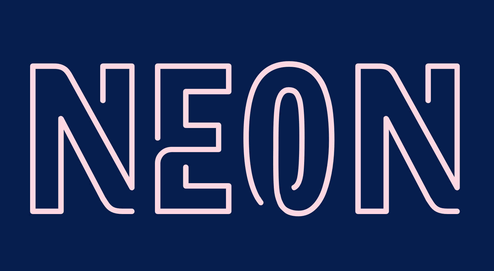

# Neon



[](https://travis-ci.org/rustbridge/neon)
[](https://crates.io/crates/neon)

A safe Rust abstraction layer for native Node.js modules.

Neon protects all handles to the JavaScript heap, even when they're allocated on the Rust stack, ensuring that objects are always safely tracked by the garbage collector.

# Getting started

Install [neon-cli](https://github.com/rustbridge/neon-cli) as a global npm package:

```
npm install -g neon-cli
```

To create a new Neon project, use `neon new`:

```
neon new my-project
```

This will ask you a few questions and then generate a project skeleton for you. Follow the instructions from there to build and run your project!

# Requirements

You'll need the following on all OSes:

* [Node](http://nodejs.org) v4 or later;
* [Rust](http://rust-lang.org) v1.5 or later;
* [multirust](https://github.com/brson/multirust) (only required for Neon projects that override the system default Rust).

For Mac OS X, you'll need:

* OS X 10.7 or later;
* [XCode](https://developer.apple.com/xcode/download/).

# A Taste...

A Neon function takes a `Call` object and produces a Rust `Result` that's either a JS value or the `Throw` constant (meaning a JS exception was thrown). The `Call` object provides access to a memory management scope, which safely manages the rooting of handles to heap objects:

```rust
fn make_an_array(call: Call) -> JsResult<JsArray> {
    let scope = call.scope; // the current scope for rooting handles
    let array: Handle<JsArray> = JsArray::new(scope, 3);
    try!(array.set(0, JsInteger::new(scope, 9000)));
    try!(array.set(1, JsObject::new(scope)));
    try!(array.set(2, JsNumber::new(scope, 3.14159)));
    Ok(array)
}
```

For a more complete demonstration, try building a hello world with `neon new`, or check out the slightly bigger [word count demo](https://github.com/dherman/wc-demo).

# Get Involved

The Neon community is just getting started and there's tons of fun to be had. Come play! :)

The [Rust Bridge community Slack](http://rustbridge.slack.com) is open to all; use [the Slackin app](http://rustbridge-community-slackin.herokuapp.com) to receive an invitation.

There's also an IRC channel at `#neon` on [Mozilla IRC](https://wiki.mozilla.org/IRC) (`irc.mozilla.org`).

# License

MIT
