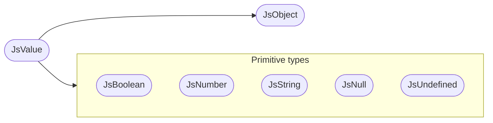
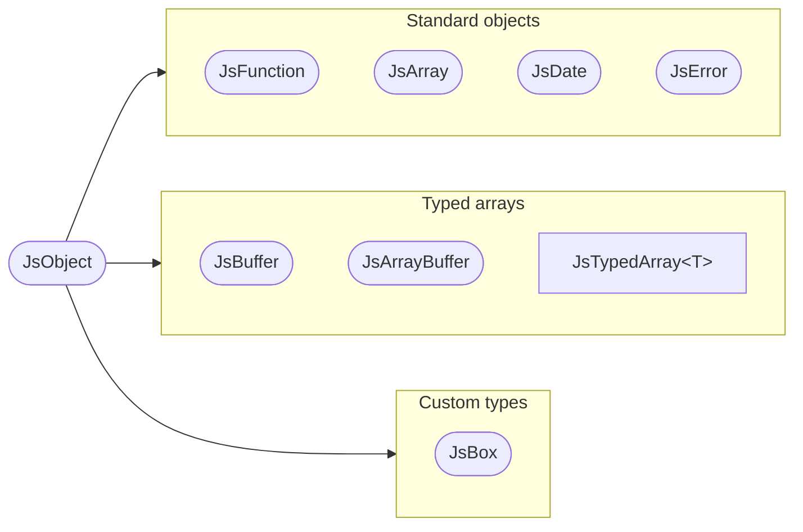

JavaScript is dynamically typed; Rust is statically typed. The
[`#[neon::export]`](/api/neon/attr.export.html) macro converts
Rust types like
[`String`](https://doc.rust-lang.org/std/string/struct.String.html),
[`f64`](https://doc.rust-lang.org/std/primitive.f64.html), and
[`Vec<u8>`](https://doc.rust-lang.org/std/vec/struct.Vec.html) on your behalf, so a lot of Neon code never thinks
about JS types at all. When you do need to — to throw a specific
error type, to build an object key by key, to interact with a class
— this page is the mental model.

## Handles, not values

A Rust binding never owns a JavaScript value directly. The garbage
collector is allowed to move objects around in memory, so Neon
gives you **handles**: smart pointers the collector knows about and
can update behind the scenes.

```rust
# use neon::prelude::*;
fn example<'cx>(cx: &mut Cx<'cx>) -> JsResult<'cx, JsString> {
    let s: Handle<'cx, JsString> = cx.string("hello");
    Ok(s)
}
```

The lifetime parameter on
[`Handle<'cx, T>`](/api/neon/handle/struct.Handle.html) ties the
value to the surrounding
[`Cx`](/api/neon/context/struct.Cx.html), so the
compiler stops you from holding it past the moment it's safe to do
so. The [lifetimes page](/explanation/lifetimes/) has the longer
version.

## The hierarchy

Every JavaScript value implements the
[`Value`](/api/neon/types/trait.Value.html) trait. From there, the
hierarchy splits into **object types** and **primitive types** (the
diagrams show the most common types, not the full set — see the
[`neon::types`](/api/neon/types/index.html) module for everything,
including `JsBigInt` and `JsPromise`):



[`JsValue`](/api/neon/types/struct.JsValue.html) is the top: a
[`Handle<JsValue>`](/api/neon/handle/struct.Handle.html) can refer
to *any* JS value, like TypeScript's
[`unknown`](https://www.typescriptlang.org/docs/handbook/2/functions.html#unknown)
type. Below it, the **primitive types** —
[`JsBoolean`](/api/neon/types/struct.JsBoolean.html),
[`JsNumber`](/api/neon/types/struct.JsNumber.html),
[`JsString`](/api/neon/types/struct.JsString.html),
[`JsNull`](/api/neon/types/struct.JsNull.html),
[`JsUndefined`](/api/neon/types/struct.JsUndefined.html) — match
JavaScript's non-object data. **Object types** live below
[`JsObject`](/api/neon/types/struct.JsObject.html) and split
further:



- **Standard objects** — JavaScript built-ins:
  [`JsFunction`](/api/neon/types/struct.JsFunction.html),
  [`JsArray`](/api/neon/types/struct.JsArray.html),
  [`JsDate`](/api/neon/types/struct.JsDate.html),
  [`JsError`](/api/neon/types/struct.JsError.html).
- **Typed arrays** — Node's binary buffers:
  [`JsBuffer`](/api/neon/types/struct.JsBuffer.html),
  [`JsArrayBuffer`](/api/neon/types/struct.JsArrayBuffer.html), and
  [`JsTypedArray<T>`](/api/neon/types/struct.JsTypedArray.html) for
  views like
  [`Uint8Array`](https://developer.mozilla.org/en-US/docs/Web/JavaScript/Reference/Global_Objects/Uint8Array)
  or
  [`Float64Array`](https://developer.mozilla.org/en-US/docs/Web/JavaScript/Reference/Global_Objects/Float64Array).
- **Custom types** —
  [`JsBox`](/api/neon/types/struct.JsBox.html), a JS object that
  owns a Rust value
  ([covered below](#jsbox--rust-data-inside-a-js-object)).

All of these implement the
[`Object`](/api/neon/object/trait.Object.html) trait, which is what
gives you [`.get(...)`](/api/neon/object/struct.PropOptions.html#method.get)
and [`.set(...)`](/api/neon/object/struct.PropOptions.html#method.set)
for properties.

## Upcasts and downcasts

Two operations move a handle between a type and its supertype.
Upcasts go up the tree and always succeed; downcasts go back down
and may fail at runtime.

- **[Upcast](/api/neon/handle/struct.Handle.html#method.upcast)** —
  always succeeds, no runtime check. Every array is an object:

  ```rust
  # use neon::prelude::*;
  fn as_object<'cx>(array: Handle<'cx, JsArray>) -> Handle<'cx, JsObject> {
      array.upcast()
  }
  ```

- **[Downcast](/api/neon/handle/struct.Handle.html#method.downcast)** —
  may fail at runtime, returning a
  [`DowncastError`](/api/neon/handle/struct.DowncastError.html). A
  [`Handle<JsObject>`](/api/neon/handle/struct.Handle.html) *might*
  be an array; the compiler can't prove
  it, so you have to check:

  ```rust
  # use neon::prelude::*;
  fn as_array<'cx>(
      cx: &mut Cx<'cx>,
      object: Handle<'cx, JsObject>,
  ) -> JsResult<'cx, JsArray> {
      object.downcast(cx).or_throw(cx)
  }
  ```

## When you actually touch these types

Most exported functions never see a
[`JsValue`](/api/neon/types/struct.JsValue.html) or a
[`Handle<JsString>`](/api/neon/handle/struct.Handle.html). The
[`TryFromJs`](/api/neon/types/extract/trait.TryFromJs.html) and
[`TryIntoJs`](/api/neon/types/extract/trait.TryIntoJs.html) traits
do the conversion automatically based on the function's signature:

```rust
# use neon::types::extract::Error;
#[neon::export]
fn slugify(input: String) -> Result<String, Error> {
    Ok(input.to_lowercase().replace(' ', "-"))
}
```

[`String`](https://doc.rust-lang.org/std/string/struct.String.html)
is a Rust type, not a
[`Handle<JsString>`](/api/neon/handle/struct.Handle.html). Neon
converts in both directions.

Reach for the lower-level types when:

- **You need [`Cx`](/api/neon/context/struct.Cx.html)** — to call a
  JS function, walk an object's keys, or build a JS value from
  scratch. See [*Get a `Cx` inside an exported function*](/how-to/cx-access/).
- **You're returning a heterogeneous value.** Either an
  [`Either<A, B>`](https://docs.rs/either/latest/either/enum.Either.html)
  (cleaner) or a
  [`Handle<JsValue>`](/api/neon/handle/struct.Handle.html).
- **You're working with a specific JS shape.** Building a result
  array, dealing with
  [`JsArray`](/api/neon/types/struct.JsArray.html),
  [`JsObject`](/api/neon/types/struct.JsObject.html), or
  [`JsError`](/api/neon/types/struct.JsError.html) handles.
- **You're using [`JsBox`](/api/neon/types/struct.JsBox.html) or
  [`#[neon::class]`](/api/neon/attr.class.html).**
  [See below](#jsbox--rust-data-inside-a-js-object).

## `JsBox` — Rust data inside a JS object

A [`JsBox<T>`](/api/neon/types/struct.JsBox.html) is a JS object that owns a Rust value of type `T`.
The JS side sees an opaque object — `typeof "object"`, no useful
properties, reference-equal across boundary crossings. The Rust
side puts any
[`'static`](https://doc.rust-lang.org/std/keyword.static.html)
value inside: a connection pool, a parser state machine, a file
descriptor.

```rust
# use neon::prelude::*;
struct Counter { value: u32 }

impl Finalize for Counter {}

#[neon::export]
fn make_counter<'cx>(cx: &mut Cx<'cx>) -> JsResult<'cx, JsBox<Counter>> {
    Ok(cx.boxed(Counter { value: 0 }))
}
```

When the JS object becomes garbage, the Rust value's
[`Drop`](https://doc.rust-lang.org/std/ops/trait.Drop.html) runs.
The GC decides *when*; Rust's destructor decides *what happens*.

[`#[neon::class]`](/api/neon/attr.class.html) applies the same idea —
Rust data owned by a JavaScript object, dropped when the GC collects
it — to generate a real JavaScript class. Instances are ordinary JS
objects carrying your Rust value (via Node-API object wrapping rather
than `JsBox`), with a constructor and methods that route through it.
The [*Build a database addon* tutorial](/tutorials/build-a-database-addon/)
walks through it end-to-end.

## Where to go next

- **See the types in action.** The
  [first-addon tutorial](/tutorials/first-addon/) and the
  [*Pass common types between Rust and JavaScript*](/how-to/common-types/)
  how-to.
- **Curious about handle lifetimes.** The
  [lifetimes page](/explanation/lifetimes/) covers
  [`Handle<'cx, T>`](/api/neon/handle/struct.Handle.html) in detail.
- **Full reference.**
  [`neon::types`](/api/neon/types/index.html) lists every concrete
  type with its methods.
